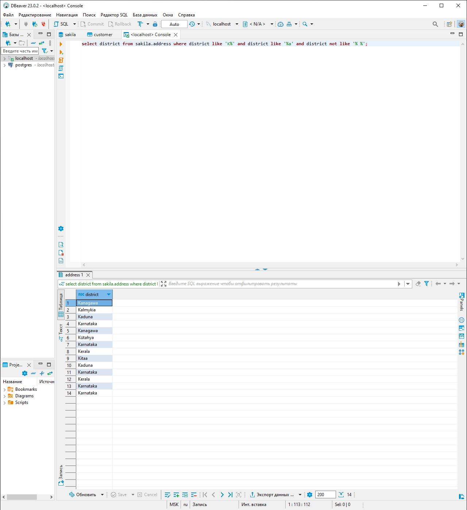
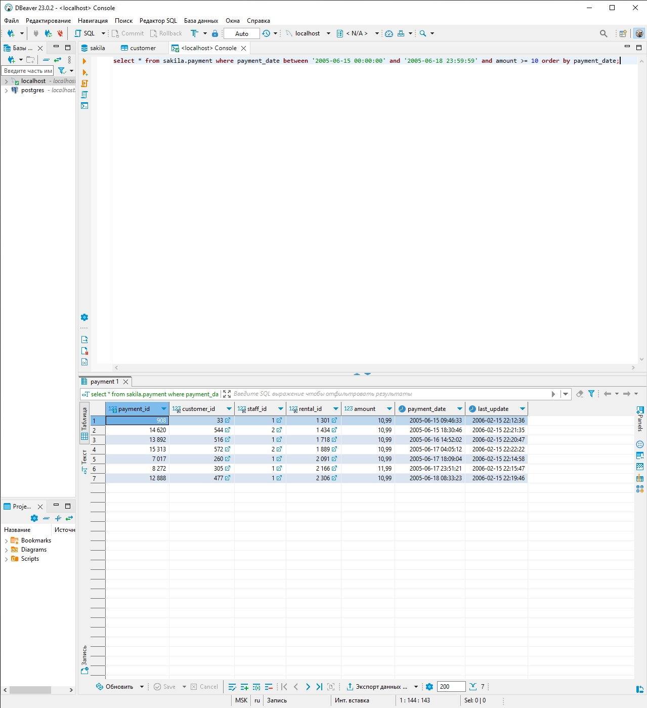

# Домашнее задание к занятию «SQL. Часть 1» - `Горбачев Олег`


Задание можно выполнить как в любом IDE, так и в командной строке.

### Задание 1

Получите уникальные названия районов из таблицы с адресами, которые начинаются на “K” и заканчиваются на “a” и не содержат пробелов.

### Задание 2

Получите из таблицы платежей за прокат фильмов информацию по платежам, которые выполнялись в промежуток с 15 июня 2005 года по 18 июня 2005 года **включительно** и стоимость которых превышает 10.00.

### Задание 3

Получите последние пять аренд фильмов.

### Задание 4

Одним запросом получите активных покупателей, имена которых Kelly или Willie. 

Сформируйте вывод в результат таким образом:
- все буквы в фамилии и имени из верхнего регистра переведите в нижний регистр,
- замените буквы 'll' в именах на 'pp'.
### Задание 1

Получите уникальные названия районов из таблицы с адресами, которые начинаются на “K” и заканчиваются на “a” и не содержат пробелов.
```sql
select district from sakila.address where district like 'K%' and district like '%a' and district not like '% %';
```


---

### Задание 2

Получите из таблицы платежей за прокат фильмов информацию по платежам, которые выполнялись в промежуток с 15 июня 2005 года по 18 июня 2005 года **включительно** и стоимость которых превышает 10.00.
```sql
select * from sakila.payment where payment_date between '2005-06-15 00:00:00' and '2005-06-18 23:59:59' and amount >= 10 order by payment_date;
```


---

### Задание 3

Получите последние пять аренд фильмов.
```sql
select * from sakila.rental order by rental_date desc limit 5;
```


---

### Задание 4

Одним запросом получите активных покупателей, имена которых Kelly или Willie. 

Сформируйте вывод в результат таким образом:
- все буквы в фамилии и имени из верхнего регистра переведите в нижний регистр,
- замените буквы 'll' в именах на 'pp'.
```sql
select customer_id, store_id, replace(LOWER(first_name),'ll','kk'), LOWER(last_name), email from sakila.customer 
where active = 1 and (first_name = 'Kelly' or first_name = 'Willie');
```

---
